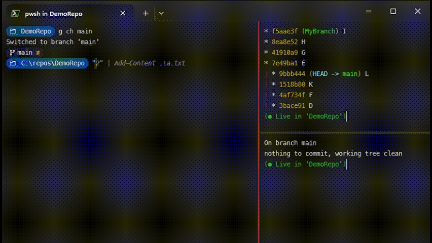

# Git Watcher

Git Watcher allows you to constantly see an up-to-date git graph or status while
using the terminal. Git Watcher automatically refreshes when it notices a change
in the state of your repository. Now, you don't have to constantly run `git status`
and `git log --graph` to the see the state of your repository!



## Install Instructions

Run the following:

```PowerShell
git clone https://github.com/WestRyanK/GitWatcher.git
cd GitWatcher
./Install.ps1
```


## How to Use

### Prerequisites

* **Windows Terminal**: Whether you use Git Watcher or not, Windows Terminal
  is the best option for PowerShell. It is especially useful for Git Watcher
  because it allows you to open side-by-side panes where you can execute commands
  in one pane and view the git graph in the other.

### Usage

1. Navigate to your git directory in Terminal.
2. Open a second pane in Terminal and navigate to the same directory.
3. Run `Watch-Git` in the second pane.
4. In the first pane, enter git commands like normal.
5. Watch as Git Watcher automatically updates as you work in the first pane.

### Syntax

```PowerShell
Watch-Git
    [[-Path] <string>]
    [[-GitCommand] {Graph | Status}]
    [[-UpdateDelaySeconds] <double>]
    [[-LiveMessage] <string>]
```

#### -Path

Specifies the path to the git repository to watch. Defaults to the current
directory if none is specified.

#### -GitCommand

Specifies which git command to continuously watch. `Graph` will show the
`git log --graph --oneline --branches`. `Status` will show `git status`.
Defaults to `Graph`.

#### -UpdateDelaySeconds

Specifies how long to wait after a file system change has been detected to
update the view. Low values may cause flickering as the view rapidly refreshes
when multiple files are changed.

#### -LiveMessage

Specifies what text to display at the bottom of the view to indicate that
the view will be updated live as changes are detected. `{0}` will be replaced
with the current repository directory.
[ANSI escape codes](https://en.wikipedia.org/wiki/ANSI_escape_code#SGR)
can be used to change colors and use other terminal effects. By default,
the Live Message is green text that says `(● Live in '{0}')`.