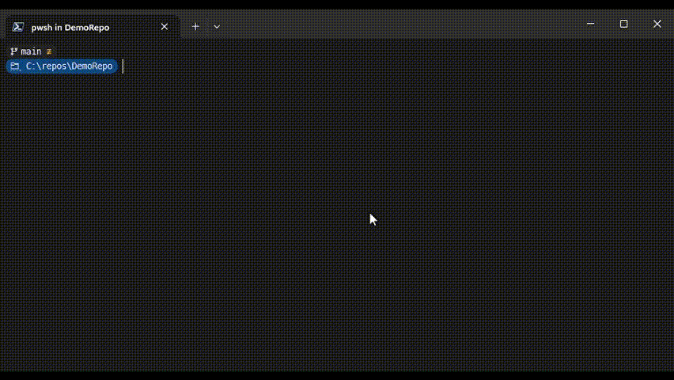

# Git Watcher

Git Watcher allows you to constantly see an up-to-date git graph or status while
using the terminal. Git Watcher automatically refreshes when it notices a change
in the state of your repository. Now, you don't have to constantly run `git status`
and `git log --graph` to the see the state of your repository!



## Prerequisites

* **Windows Terminal**: Whether you use Git Watcher or not, Windows Terminal
  is the best option for PowerShell. It is especially useful for Git Watcher
  because it allows you to open side-by-side panes where you can execute commands
  in one pane and view the git graph in the other.
* **Git**: Git Watcher is used to watch a git repository. If you don't have git
  installed, this tool obviously won't work.

## Install Instructions

Run the following:

```PowerShell
git clone https://github.com/WestRyanK/GitWatcher.git
cd GitWatcher
./Install.ps1
```

## Start-GitWatcher

The `Start-GitWatcher` command allows you to automate opening a series of Windows
Terminal panes that are watching different git commands. If no `LayoutCommands` are
specified, it will use the following layout:


```PowerShell
Start-GitWatcher
    [[-Path] <string>]
    [-QuakeMode]
    [[-LayoutCommands] <string[]>]
```

#### -Path

Specifies the path to the git repository to watch. Defaults to the current
directory if none is specified.

#### -QuakeMode

If you are using Windows Terminal in quake mode, you must specify this switch.
Otherwise, the Git Watcher panes will open in a new window.

#### -LayoutCommands

Specifies an array of commands that are sequentially issued to Windows
Terminal in order to create the Git Watcher panes. Each command item in the
array is of form `WindowCommand:PaneCommand`. For some items, you may want to
execute only a `WindowCommand`. In those cases, `PaneCommand` will be empty.

`Start-GitWatcher` will run the `LayoutCommands` sequentially in the following manner:
1. The `WindowCommand` will execute in the current Windows Terminal window. Normally,
  you will use a `split-pane` or `move-focus` command [from here](https://learn.microsoft.com/en-us/windows/terminal/command-line-arguments?tabs=windows#split-pane-command).
2. The `PaneCommand` will then execute in the focused Windows Terminal pane. Normally,
  you will call `Watch-Git` with some parameters here.

The following example demonstrates how the default pane layout is generated:
```PowerShell
Start-GitWatcher -LayoutCommands (
  "split-pane --vertical:             Watch-Git -GitCommand Graph",
  "split-pane --horizontal:           Watch-Git -GitCommand Status",
  "split-pane --vertical --size .3:   Watch-Git -GitCommand Branch",
  "move-focus first" )
```

> **Note:** To easily reuse your Git Watcher layout, I recommend creating a function
  in your PowerShell profile that calls `Start-GitWatcher` with your desired layout
  commands.

## Watch-Git

The `Watch-Git` command should rarely be used by itself; instead, you should use
the `Start-GitWatcher` command. If you want to adjust the layout of Git Watcher,
you will need to use the `Watch-Git` command within the `LayoutCommands` parameters.

```PowerShell
Watch-Git
    [[-Path] <string>]
    [[-GitCommand] {Graph | Status | Branch}]
    [[-UpdateDelaySeconds] <double>]
    [[-LiveMessage] <string>]
```

#### -Path

Specifies the path to the git repository to watch. Defaults to the current
directory if none is specified.

#### -GitCommand

Specifies which git command to continuously watch. Defaults to `Graph`.
* `Graph` will show the `git log --graph --oneline --branches`.
* `Status` will show `git status`.
* `Branch` will show `git branch`.

#### -UpdateDelaySeconds

Specifies how long to wait after a file system change has been detected to
update the view. Low values may cause flickering as the view rapidly refreshes
when multiple files are changed.

#### -LiveMessage

Specifies what text to display at the bottom of the view to indicate that
the view will be updated live as changes are detected. `{0}` will be replaced
with the current repository directory.
[ANSI escape codes](https://en.wikipedia.org/wiki/ANSI_escape_code#SGR)
can be used to change colors and use other terminal effects. By default,
the Live Message is green text that says `(● Live in '{0}')`.

#### -LineMode

Specifies how long lines should be handled. The value of `Wrap` causes long
lines to be wrapped around to the next line. The value of `Clip` causes long
lines to be clipped so that they never wrap to the next line.